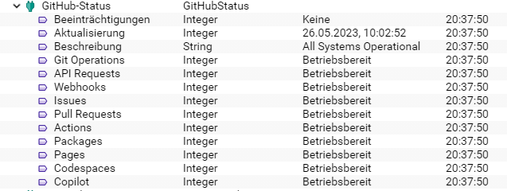
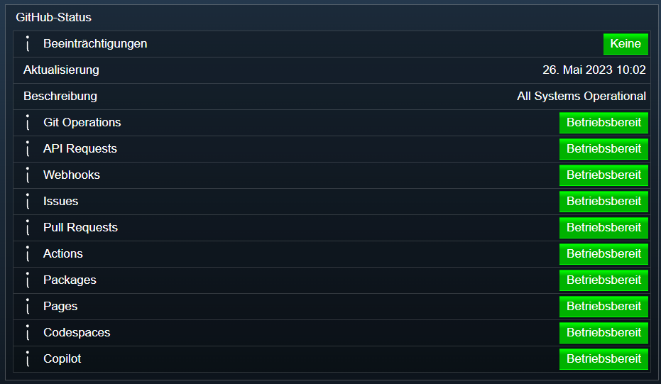

  

 
  

 

# GitHub-Status <!-- omit in toc -->  

Dieses Modul zeigt den aktuellen Status der GitHub-Dienste an.  

## Dokumentation <!-- omit in toc -->

**Inhaltsverzeichnis**  

- [1. Funktionsumfang](#1-funktionsumfang)
- [2. Voraussetzungen](#2-voraussetzungen)
- [3. Installation](#3-installation)
- [5. Einrichten der Instanzen in IPS](#5-einrichten-der-instanzen-in-ips)
- [6. Statusvariablen und Profile](#6-statusvariablen-und-profile)
- [7. Spenden](#7-spenden)
- [8. Changelog](#8-changelog)
- [9. Lizenz](#9-lizenz)

## 1. Funktionsumfang

 Über die JSON-API von  [GitHub](https://github.com) wird der aktuelle Status ermittelt und in Variablen abgebildet.  

## 2. Voraussetzungen

 - IPS 7.0 oder höher  
 
## 3. Installation

   Bei privater Nutzung: Über den `Module-Store` in IPS das Modul `GitHub Status` hinzufügen.  

   **Bei kommerzieller Nutzung (z.B. als Errichter oder Integrator) wenden Sie sich bitte an den Autor.**  

## 5. Einrichten der Instanzen in IPS

   Unter Instanz hinzufügen ist die Instanz `GitHubStatus` unter dem Hersteller `GitHub` aufgeführt.  

## 6. Statusvariablen und Profile

     
     

   Die Statusvariablen werden automatisch angelegt.

## 7. Spenden  

  Die Library ist für die nicht kommerzielle Nutzung kostenlos, Schenkungen als Unterstützung für den Autor werden hier akzeptiert:  

## 8. Changelog  

Version 3.01:  
    - Version für IPS 7.0.  

Version 3.00:  
    - Statusmeldungen der Dienste erweitert.  

Version 2.10:  
    - Release für IPS 5.1 und den Module-Store .  

 Version 2.00:  
    - Neu: Neue Statuspage von GitHub wird verwendet.  
    - Neu: Anpassungen für IPS 5.1.  

 Version 1.03:  
    - Neu: Übersetzungen für IPS 4.3.  

 Version 1.02:  
    - Fix: Timer in Create verschoben.  

 Version 1.01:  
    - Readme und Doku erweitert.  

 Version 1.0:  
    - Erstes Release  

## 9. Lizenz

  [CC BY-NC-SA 4.0](https://creativecommons.org/licenses/by-nc-sa/4.0/)  
